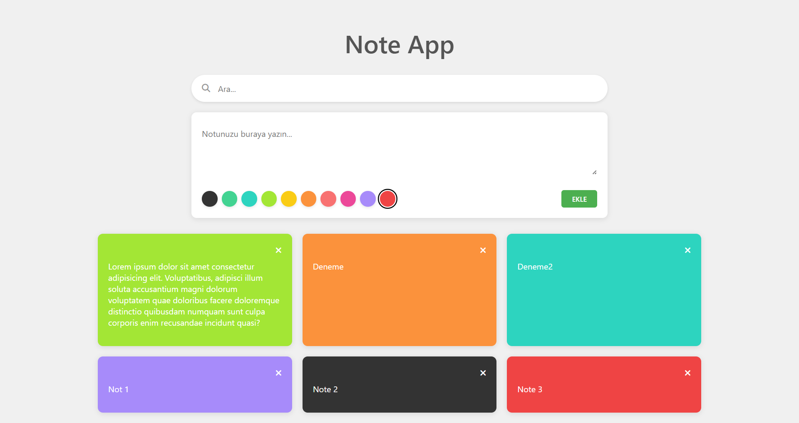

# 📝 Notes App | React + Vite

[🇹🇷 Click for Turkish README](./README.tr.md)

*Created on: April 18, 2025*

A simple and user-friendly note-taking application built with React and Vite.
* This project was created for Patika Frontend Bootcamp **Week-10 / Assignment-2 | Note App**.
* Features basic note-taking and search functionality.
* Built with **React**, **Vite**, **CSS3**, and **JavaScript**.
* State management provided with React Hooks.

---

## 🚀 Live Demo

Visit the live site :  [Notes App | Vercel](https://notes-app-reactjs-omega.vercel.app/)

---

## :computer: Installation & Usage

1. Clone the repository:
```bash
git clone https://github.com/tunahanyasar/notes-app-reactjs.git
```

2. Navigate to the project folder:
```bash
cd notes-app-reactjs
```

3. Install dependencies:
```bash
npm install
```

4. Start the development server:
```bash
npm run dev
```

5. Open in your browser: [http://localhost:5173](http://localhost:5173)

---

## 🎮 How to Use?

1. **Add Note**:
   - Write your note in the text area
   - Select your desired color
   - Click the "EKLE" button

2. **Delete Note**:
   - Click the delete button in the top-right corner of the note you want to remove

3. **Search Notes**:
   - Type the word you want to search in the search bar at the top
   - Notes will be filtered automatically

---

## 📜 Project Structure

:open_file_folder: **Folders:**
* *src/*
  * *components/*
    * *Note.jsx*
    * *NoteForm.jsx*
    * *NoteList.jsx*
    * *SearchBar.jsx*
    * *NoteApp.jsx*
  * *App.jsx*
  * *App.css*
  * *main.jsx*
  * *index.css*
* *index.html*
* *package.json*

1. ***src/components/***: React components are located here.
    * **Note.jsx**: Individual note card component.
    * **NoteForm.jsx**: Component containing the note addition form.
    * **NoteList.jsx**: Component that manages the note list.
    * **SearchBar.jsx**: Component that manages search operations.
    * **NoteApp.jsx**: Main application component.

2. ***App.css***: All CSS properties.

3. ***App.jsx***: Main application file.

---

## :star2: Current Features

1. **Note Operations**
   - Add notes
   - Delete notes
   - Color selection
   - Note content editing

2. **Search Operations**
   - Word-based search functionality
   - Real-time filtering

3. **Modern UI/UX**
   - User-friendly interface
   - Responsive design
   - Clean and organized code structure

---

## 🔄 Future Features to be Added

1. **Advanced Note Operations**
   - Note editing and updating
   - Note copying
   - Trash management
      - Restore deleted notes
      - Permanent deletion option

2. **Advanced Search and Filtering**
   - Color-based filtering
   - Search within trash
   - Color filter within trash

3. **Text Formatting**
   - Title: First letter of each word capitalized
   - Content: First letter of each line's first word capitalized
   - Preserve line breaks

4. **Local Storage**
   - Store notes in browser local storage
   - Keep trash content in local storage

5. **Help System**
   - Detailed usage guide
   - Icon guide
   - Information about page usage

6. **Responsive Design**
    - Use CSS Grid and Flexbox for page layout to create design compatible with different screen sizes

---

## 💡 Technologies & Concepts Used

**React:**
* Component Architecture
* Props System
* React Hooks (useState, useEffect)
* Event Handling
* Conditional Rendering

**CSS:**
* Flexbox Layout
* CSS Grid
* Transform & Transitions
* Responsive Design
* Custom Properties

**JavaScript:**
* ES6+ Features
* Array Methods
* String Manipulation
* Event Handling
* State Management

---

## :camera: Screenshots

### Full Page View


---

## 🔍 Detailed Description

### Project Purpose and Scope

This project is a simple and user-friendly note-taking application that allows users to easily manage their notes. A modern user interface has been created with React.

### Technical Details

#### NoteApp.jsx - Main Application Component

**NoteApp.jsx** file is the main component of the application and contains the following important functions:

1. **State Management**: 
   - Notes and search state are managed with useState hooks
   - Filtering operations are performed with useEffect hook

2. **Layout Structure**:
   - Title and search bar at the top
   - Note form and note list at the bottom
   - Responsive design with CSS Grid and Flexbox

#### User Experience
- **Visual Feedback**: Visual feedback when notes are added and deleted
- **Color Selection**: Easy color selection
- **Search**: Fast search with real-time filtering

### Future Developments

- **Category System**: Organizing notes by categories
- **Tag System**: Adding tags to notes and filtering
- **Export/Import**: Export and import notes feature
- **Theme Options**: Dark/light theme options
- **Sorting Options**: Sorting notes by date or color
- **Sharing Features**: Sharing notes on social media
- **Multi-language Support**: Different language options

---

## 📞 Contact

[Tunahan Yaşar](https://github.com/tunahanyasar)

* GitHub: [@tunahanyasar](https://github.com/tunahanyasar)
* LinkedIn: [Tunahan Yaşar](https://www.linkedin.com/in/tunahan-yasar/) 